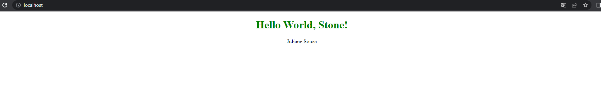
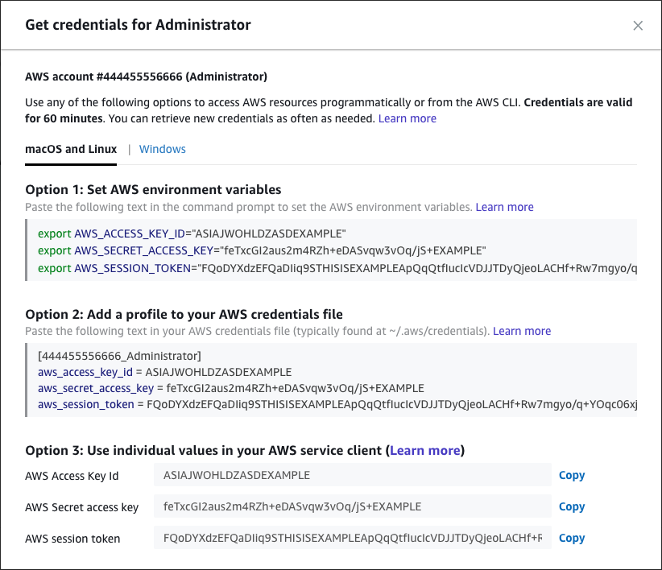

# Desafio Devops

## Requisitos
- Uma conta na AWS 
- Terraform
- Docker
- docker-compose

  

<br></br>
## Para rodar localmente com Docker

Para rodar localmente usando **DOCKER**, siga o passo a passo:

1 - Faça o clone do repositório na sua máquina local

```bash
git clone https://github.com/julianesouza/desafiodevops.git
```

2 - Em seguida, entre dentro do diretório que contém o arquivo **Docker**

```bash
cd desafiodevops/app
```
3 - Rode o comando
```bash
docker-compose up
```
A aplicação roda na porta 80. Coloque em seu *browser*:
```
http://localhost:80
```
ou apenas
```
http://localhost
```
4 - A aplicação final deve seguir o seguinte modelo:


<br></br>
## Para subir no ambiente AWS

Para subir na AWS, é preciso ter uma conta e ter acesso às *variáveis de ambiente*:
- AWS_ACCESS_KEY_ID
- AWS_SECRET_ACCESS_KEY
- AWS_SESSION_TOKEN

Essas variáveis estarão disponíveis quando for entrar na conta:

Clique na conta > *Command line or programmatic access* > Use a Opção 1 para configurar variáveis dentro do *prompt de comando*

***Imagem meramente ilustrativa***


Depois dessa configuração, com o **terraform** instalado, siga os seguintes comandos:

1 - Para inicializar o backend 
```bash
terraform init
```

2 - Para visualizar o que será criado (***opcional***)
```bash
terraform plan
```

3 - Para aplicar o código na AWS
```bash
terraform apply
```

Depois, espere até que a infraestrutura suba na nuvem. Após isso, ***espere no mínimo 60 segundos*** e teste com o **output** que será mostrado na tela. 
```
http://{ip que será criado e mostrado como output}
```

Esses 60 segundos são baseados em testes feitos no ambiente. Foi usado um script com *user_data* na hora da criação da EC2. Significa que este script só é executado **após** a criação da EC2, eis o motivo do leve *delay*.

## Arquitetura Final
.png)